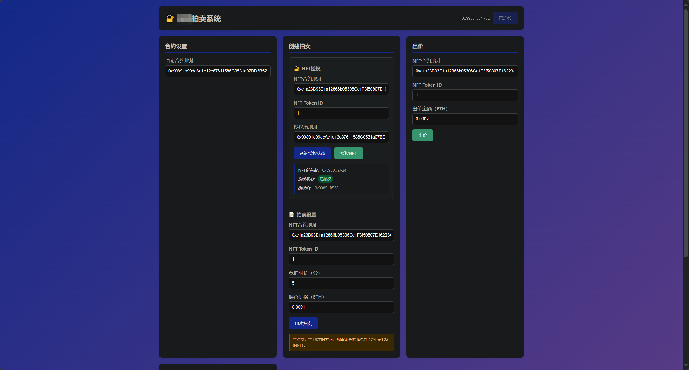
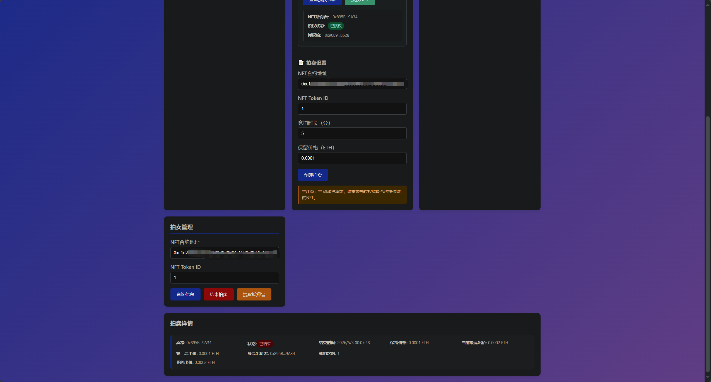

# 🔐 保密拍卖系统 (Confidential Auction System)

一个基于以太坊区块链的NFT保密拍卖系统，采用第二价格拍卖机制，确保拍卖过程的公平性和隐私性。

A decentralized NFT auction system built on Ethereum blockchain, utilizing second-price auction mechanism to ensure fairness and privacy in auction process.

---

## 📋 目录 (Table of Contents)

- [项目简介](#项目简介) - [Project Overview](#project-overview)
- [功能特性](#功能特性) - [Features](#features)
- [技术架构](#技术架构) - [Technical Architecture](#technical-architecture)
- [智能合约说明](#智能合约说明) - [Smart Contract Documentation](#smart-contract-documentation)
- [前端应用说明](#前端应用说明) - [Frontend Application Documentation](#frontend-application-documentation)
- [安装部署](#安装部署) - [Installation & Deployment](#installation--deployment)
- [使用教程](#使用教程) - [Usage Tutorial](#usage-tutorial)
- [安全注意事项](#安全注意事项) - [Security Considerations](#security-considerations)
- [项目截图](#项目截图) - [Project Screenshots](#project-screenshots)
- [开发指南](#开发指南) - [Development Guide](#development-guide)
- [常见问题](#常见问题) - [FAQ](#faq)
- [许可证](#许可证) - [License](#license)

---

## 🎯 项目简介 (Project Overview)

### 中文

保密拍卖系统是一个去中心化的NFT拍卖平台，基于以太坊智能合约构建。系统采用第二价格拍卖机制（Vickrey拍卖），获胜者只需支付第二高出价的价格，这种机制能够鼓励参与者真实出价，提高拍卖效率。

### English

The Confidential Auction System is a decentralized NFT auction platform built on Ethereum smart contracts. The system utilizes a second-price auction mechanism (Vickrey auction), where the winner pays only the second-highest bid price. This mechanism encourages participants to bid truthfully and improves auction efficiency.

### 核心特性 (Core Features)

- **第二价格拍卖机制**：获胜者支付第二高出价，鼓励真实出价
- **NFT资产支持**：完全兼容ERC721标准的NFT代币
- **隐私保护**：出价信息在拍卖结束前保密
- **防重入攻击**：集成OpenZeppelin的ReentrancyGuard保护
- **自动化结算**：拍卖结束后自动执行资产转移和资金分配

- **Second-price auction mechanism**: Winner pays second-highest bid, encouraging truthful bidding
- **NFT asset support**: Fully compatible with ERC721 standard NFT tokens
- **Privacy protection**: Bidding information remains confidential until auction ends
- **Reentrancy protection**: Integrated with OpenZeppelin's ReentrancyGuard
- **Automated settlement**: Automatically executes asset transfer and fund distribution after auction ends

---

## ✨ 功能特性 (Features)

### 智能合约功能 (Smart Contract Features)

- ✅ 创建拍卖：设置NFT、竞拍时长、保留价格
- ✅ 参与竞拍：提交密封出价
- ✅ 结束拍卖：自动结算并转移资产
- ✅ 提取抵押品：非获胜者取回出价资金
- ✅ 查询信息：实时查看拍卖状态和出价情况

- ✅ Create auction: Set NFT, bidding duration, and reserve price
- ✅ Participate in bidding: Submit sealed bids
- ✅ End auction: Automatically settle and transfer assets
- ✅ Withdraw collateral: Non-winners retrieve their bid funds
- ✅ Query information: Real-time viewing of auction status and bids

### 前端应用功能 (Frontend Application Features)

- 🔐 MetaMask钱包集成
- 📝 NFT授权管理
- 🎨 直观的用户界面
- 📊 实时状态更新
- ⚡ 快速交易处理
- 📱 响应式设计

- 🔐 MetaMask wallet integration
- 📝 NFT authorization management
- 🎨 Intuitive user interface
- 📊 Real-time status updates
- ⚡ Fast transaction processing
- 📱 Responsive design

---

## 🏗️ 技术架构 (Technical Architecture)

```
拍卖系统
├── 智能合约层 (Solidity 0.8.33)
│   ├── ConfidentialAuction.sol - 主拍卖合约
│   ├── IConfidentialAuctionErrors.sol - 错误接口
│   └── OpenZeppelin - 安全库依赖
├── 前端应用层 (React 18)
│   ├── App.js - 主应用组件
│   ├── App.css - 样式文件
│   └── Ethers.js - 区块链交互库
└── 开发工具 (Foundry)
    ├── Forge - 编译和测试
    ├── Cast - 合约交互
    └── Anvil - 本地节点
```


---

## 📜 智能合约说明 (Smart Contract Documentation)

### 核心数据结构 (Core Data Structures)

```solidity
struct Auction {
    address seller;              // 卖家地址 (Seller address)
    uint32  endOfBiddingPeriod;  // 竞拍结束时间 (Bidding end time)
    bool    started;              // 拍卖是否开始 (Whether auction has started)
    uint32  count;                // 竞拍次数 (Bidding count)
    uint256 topBid;               // 最高出价 (Highest bid)
    uint256 secondTopBid;        // 第二高出价 (Second highest bid)
    uint256 reservePrice;         // 保留价格 (Reserve price)
    address topBidder;            // 最高出价者 (Highest bidder)
}

struct BidInfo {
    uint256 bidValue;            // 出价金额 (Bid amount)
    address tokenContract;        // NFT合约地址 (NFT contract address)
    uint256 tokenId;             // NFT Token ID
}
```

### 主要函数 (Main Functions)

#### 1. 创建拍卖 (Create Auction)

```solidity
function createAuction(
    address tokenContract,  // NFT合约地址 (NFT contract address)
    uint256 tokenId,        // NFT Token ID
    uint32  bidPeriod,     // 竞拍时长（秒）(Bidding duration in seconds)
    uint64  reservePrice    // 保留价格（wei）(Reserve price in wei)
) external nonReentrant
```

**要求 (Requirements):**
- NFT必须已授权给拍卖合约 (NFT must be approved to be auction contract)
- 竞拍时长最少5分钟 (Bidding duration must be at least 5 minutes)
- 卖家必须拥有该NFT (Seller must own the NFT)

#### 2. 参与竞拍 (Participate in Bidding)

```solidity
function bid(
    address tokenContract,  // NFT合约地址 (NFT contract address)
    uint256 tokenId         // NFT Token ID
) external payable nonReentrant
```

**要求 (Requirements):**
- 出价必须大于保留价格 (Bid must be greater than reserve price)
- 每个地址只能出价一次 (Each address can only bid once)
- 必须在竞拍期内 (Must be within bidding period)

#### 3. 结束拍卖 (End Auction)

```solidity
function endAuction(
    address tokenContract,  // NFT合约地址 (NFT contract address)
    uint256 tokenId         // NFT Token ID
) external nonReentrant
```

**结算逻辑 (Settlement Logic):**
- 无出价：NFT退还给卖家 (No bids: NFT returned to seller)
- 有出价：NFT转给最高出价者，卖家获得第二高出价 (With bids: NFT transferred to highest bidder, seller receives second-highest bid)
- 最高出价者获得差价退款 (Highest bidder receives difference refund)

#### 4. 提取抵押品 (Withdraw Collateral)

```solidity
function withdrawCollateral(
    address tokenContract,  // NFT合约地址 (NFT contract address)
    uint256 tokenId         // NFT Token ID
) external nonReentrant
```

**适用对象 (Applicable to):** 非获胜出价者 (Non-winning bidders)

### 事件 (Events)

```solidity
event AuctionCreated(
    address indexed tokenContract,
    uint256 indexed tokenId,
    address indexed seller,
    uint32 bidPeriod,
    uint256 reservePrice
);

event Bidded(
    address indexed tokenContract,
    uint256 indexed tokenId
);
```

---

## 🎨 前端应用说明 (Frontend Application Documentation)

### 技术栈 (Tech Stack)

- **React 18** - 用户界面框架 (User interface framework)
- **Ethers.js 5.7** - 区块链交互库 (Blockchain interaction library)
- **MetaMask** - 钱包集成 (Wallet integration)
- **CSS3** - 样式设计 (Style design)

### 主要组件 (Main Components)

#### 1. 钱包连接 (Wallet Connection)
- 自动检测MetaMask (Auto-detect MetaMask)
- 账户切换监听 (Account switch monitoring)
- 网络状态显示 (Network status display)

#### 2. NFT授权 (NFT Authorization)
- ERC721 approve函数集成 (ERC721 approve function integration)
- 授权状态查询 (Authorization status query)
- 实时状态更新 (Real-time status updates)

#### 3. 创建拍卖 (Create Auction)
- 参数输入验证 (Parameter input validation)
- 交易状态跟踪 (Transaction status tracking)
- 错误处理和提示 (Error handling and prompts)

#### 4. 参与竞拍 (Participate in Bidding)
- 出价金额输入 (Bid amount input)
- 实时余额检查 (Real-time balance check)
- 交易确认流程 (Transaction confirmation process)

#### 5. 拍卖管理 (Auction Management)
- 拍卖信息查询 (Auction information query)
- 结束拍卖操作 (End auction operation)
- 抵押品提取 (Collateral withdrawal)

---

## 🚀 安装部署 (Installation & Deployment)

### 前置要求 (Prerequisites)

- Node.js >= 14.0.0
- npm 或 yarn (npm or yarn)
- MetaMask浏览器扩展 (MetaMask browser extension)
- Git

### 智能合约部署 (Smart Contract Deployment)

#### 1. 安装Foundry (Install Foundry)

```bash
curl -L https://foundry.paradigm.xyz | bash
foundryup
```

#### 2. 编译合约 (Compile Contracts)

```bash
cd confidential_auction
forge build
```

#### 3. 运行测试 (Run Tests)

```bash
forge test
```

#### 4. 部署合约 (Deploy Contracts)

```bash
# 部署到本地测试网络 (Deploy to local test network)
anvil &
forge script script/Deploy.s.sol --rpc-url http://localhost:8545 --broadcast

# 部署到测试网络（如Sepolia）(Deploy to test network like Sepolia)
forge script script/Deploy.s.sol --rpc-url https://sepolia.infura.io/v3/YOUR_KEY --broadcast --verify --etherscan-api-key YOUR_API_KEY
```

### 前端应用部署 (Frontend Application Deployment)

#### 1. 安装依赖 (Install Dependencies)

```bash
cd frontend
npm install
```

#### 2. 配置环境变量 (Configure Environment Variables)

创建 `.env` 文件 (Create `.env` file):

```env
REACT_APP_AUCTION_CONTRACT_ADDRESS=0x...
REACT_APP_NETWORK_ID=11155111  # Sepolia测试网 (Sepolia testnet)
```

#### 3. 启动开发服务器 (Start Development Server)

```bash
npm start
```

应用将在 http://localhost:3000 启动 (Application will start at http://localhost:3000)

#### 4. 构建生产版本 (Build Production Version)

```bash
npm run build
```

#### 5. 部署到静态托管 (Deploy to Static Hosting)

```bash
# 部署到Netlify (Deploy to Netlify)
npm install -g netlify-cli
netlify deploy --prod --dir=build

# 部署到Vercel (Deploy to Vercel)
vercel --prod
```

---

## 📖 使用教程 (Usage Tutorial)

### 第一步：连接钱包 (Step 1: Connect Wallet)

1. 打开应用，点击右上角"连接钱包"按钮 (Open the app, click "Connect Wallet" button in the top right corner)
2. 在MetaMask中授权连接 (Authorize connection in MetaMask)
3. 确保连接到正确的网络（测试网或主网）(Ensure connected to the correct network - testnet or mainnet)

### 第二步：授权NFT (Step 2: Authorize NFT)

1. 在"创建拍卖"区域，输入NFT合约地址和Token ID (In the "Create Auction" area, enter the NFT contract address and Token ID)
2. 输入要授权的地址（拍卖合约地址）(Enter the address to authorize - auction contract address)
3. 点击"授权NFT"按钮 (Click "Authorize NFT" button)
4. 在MetaMask中确认授权交易 (Confirm authorization transaction in MetaMask)
5. 等待交易确认 (Wait for transaction confirmation)



### 第三步：创建拍卖 (Step 3: Create Auction)

1. 在"拍卖设置"区域，设置竞拍参数 (In the "Auction Settings" area, set bidding parameters):
   - 竞拍时长（小时）(Bidding duration in hours)
   - 保留价格（ETH）(Reserve price in ETH)
2. 点击"创建拍卖"按钮 (Click "Create Auction" button)
3. 在MetaMask中确认交易 (Confirm transaction in MetaMask)
4. 等待交易确认 (Wait for transaction confirmation)



### 第四步：参与竞拍 (Step 4: Participate in Bidding)

1. 切换到竞拍者账户 (Switch to bidder account)
2. 在"出价"区域，输入拍卖信息 (In the "Bid" area, enter auction information)
3. 输入出价金额（必须大于保留价格）(Enter bid amount - must be greater than reserve price)
4. 点击"出价"按钮 (Click "Bid" button)
5. 在MetaMask中确认交易 (Confirm transaction in MetaMask)

### 第五步：结束拍卖 (Step 5: End Auction)

1. 等待竞拍期结束 (Wait for bidding period to end)
2. 在"拍卖管理"区域，点击"结束拍卖"按钮 (In the "Auction Management" area, click "End Auction" button)
3. 系统自动结算 (System automatically settles):
   - NFT转移给最高出价者 (NFT transferred to highest bidder)
   - ETH转移给卖家 (ETH transferred to seller)
   - 差价退还给最高出价者 (Difference refunded to highest bidder)

### 第六步：提取抵押品 (Step 6: Withdraw Collateral)

1. 非获胜出价者可以在拍卖结束后提取自己的出价 (Non-winning bidders can withdraw their bids after auction ends)
2. 在"拍卖管理"区域，点击"提取抵押品"按钮 (In the "Auction Management" area, click "Withdraw Collateral" button)
3. 等待交易确认 (Wait for transaction confirmation)

---

## 🔒 安全注意事项 (Security Considerations)

### 智能合约安全 (Smart Contract Security)

- ✅ 防重入攻击保护 (Reentrancy attack protection)
- ✅ 输入参数验证 (Input parameter validation)
- ✅ 权限控制检查 (Permission control checks)
- ✅ 紧急暂停机制 (Emergency pause mechanism)

### 用户安全 (User Security)

- 🔐 始终验证合约地址 (Always verify contract addresses)
- 🧪 先在测试网测试 (Test on testnet first)
- 💰 注意Gas费用 (Be aware of gas fees)
- 🔑 保护私钥和助记词 (Protect private keys and seed phrases)
- ✅ 仔细检查交易详情 (Carefully check transaction details)

### 最佳实践 (Best Practices)

1. **测试优先**：在主网部署前充分测试 (Test first: Thoroughly test before mainnet deployment)
2. **小额测试**：首次使用时用小额资金测试 (Small amount testing: Test with small amounts when using for the first time)
3. **定期审计**：定期进行安全审计 (Regular audits: Conduct security audits regularly)
4. **备份重要**：备份重要的交易哈希和合约地址 (Backup important: Backup important transaction hashes and contract addresses)
5. **保持更新**：及时更新依赖库和安全补丁 (Stay updated: Update dependencies and security patches promptly)

---

## 📸 项目截图 (Project Screenshots)

### 界面展示 (Interface Display)

#### 1. NFT授权界面 (NFT Authorization Interface)


用户可以通过此界面授权拍卖合约操作其NFT资产，确保拍卖流程的顺利进行。
Users can authorize the auction contract to operate their NFT assets through this interface, ensuring a smooth auction process.

#### 2. 创建拍卖界面 (Create Auction Interface)


创建拍卖的主界面，用户可以设置拍卖参数并启动新的NFT拍卖。
The main interface for creating auctions, where users can set auction parameters and start new NFT auctions.

---

## 🛠️ 开发指南 (Development Guide)

### 项目结构 (Project Structure)

```
confidential_auction/
├── src/
│   ├── ConfidentialAuction.sol       # 主拍卖合约
│   └── IConfidentialAuctionErrors.sol # 错误接口
├── script/
│   └── Deploy.s.sol                  # 部署脚本
├── test/
│   └── ConfidentialAuction.t.sol     # 测试文件
├── frontend/
│   ├── src/
│   │   ├── App.js                    # 主应用组件
│   │   ├── App.css                   # 样式文件
│   │   └── index.js                  # 入口文件
│   ├── public/
│   │   └── index.html                # HTML模板
│   └── package.json                  # 依赖配置
├── foundry.toml                      # Foundry配置
├── foundry.lock                      # 依赖锁定
└── README.md                         # 项目文档
```


### 智能合约开发 (Smart Contract Development)

#### 编译合约 (Compile Contracts)

```bash
forge build
```

#### 运行测试 (Run Tests)

```bash
# 运行所有测试 (Run all tests)
forge test

# 运行特定测试 (Run specific test)
forge test --match-test testCreateAuction

# 显示Gas使用情况 (Show gas usage)
forge test --gas-report

# 显示详细输出 (Show detailed output)
forge test -vvv
```

#### 代码格式化 (Format Code)

```bash
forge fmt
```

#### 代码检查 (Check Code)

```bash
forge check
```

### 前端开发 (Frontend Development)

#### 启动开发服务器 (Start Development Server)

```bash
cd frontend
npm start
```

#### 运行测试 (Run Tests)

```bash
npm test
```

#### 代码检查 (Check Code)

```bash
npm run lint
```

### 贡献指南 (Contribution Guidelines)

1. Fork项目 (Fork the project)
2. 创建特性分支 (`git checkout -b feature/AmazingFeature`) (Create feature branch)
3. 提交更改 (`git commit -m 'Add some AmazingFeature'`) (Commit changes)
4. 推送到分支 (`git push origin feature/AmazingFeature`) (Push to branch)
5. 开启Pull Request (Open Pull Request)

---

## ❓ 常见问题 (FAQ)

### Q1: 为什么我的出价失败了？(Why did my bid fail?)

**A:** 请检查以下几点 (Please check the following points):
- 出价金额是否大于保留价格 (Is the bid amount greater than the reserve price?)
- 是否在竞拍期内 (Is it within the bidding period?)
- 是否已经出价过（每个地址只能出价一次）(Have you already bid - each address can only bid once?)
- 账户余额是否足够 (Is the account balance sufficient?)

### Q2: 如何知道我是否赢得了拍卖？(How do I know if I won the auction?)

**A:** 你可以通过"查询拍卖信息"功能查看 (You can check through the "Query Auction Information" function):
- 检查"最高出价者"是否为你的地址 (Check if the "Highest Bidder" is your address)
- 确认拍卖状态为"已结束" (Confirm the auction status is "Ended")

### Q3: 拍卖结束后多久可以提取抵押品？(How soon after the auction ends can I withdraw collateral?)

**A:** 拍卖结束后，非获胜出价者可以立即提取自己的出价资金。(After the auction ends, non-winning bidders can immediately withdraw their bid funds.)

### Q4: 如果没有人出价会怎样？(What happens if no one bids?)

**A:** 如果没有人出价或出价未达到保留价格：(If no one bids or bids don't reach the reserve price:)
- NFT将退还给卖家 (The NFT will be returned to the seller)
- 卖家可以重新创建拍卖 (The seller can recreate the auction)

### Q5: Gas费用大概多少？(How much are the gas fees?)

**A:** Gas费用取决于网络拥堵情况：(Gas fees depend on network congestion:)
- 创建拍卖：约100,000-200,000 gas (Create auction: approximately 100,000-200,000 gas)
- 出价：约50,000-100,000 gas (Bid: approximately 50,000-100,000 gas)
- 结束拍卖：约150,000-300,000 gas (End auction: approximately 150,000-300,000 gas)

### Q6: 支持哪些网络？(Which networks are supported?)

**A:** 目前支持：(Currently supported:)
- Ethereum主网 (Ethereum mainnet)
- Sepolia测试网 (Sepolia testnet)
- Goerli测试网 (Goerli testnet)
- 任何EVM兼容网络 (Any EVM-compatible network)

### Q7: 如何切换网络？(How to switch networks?)

**A:** 在MetaMask中：(In MetaMask:)
1. 点击网络名称 (Click the network name)
2. 选择或添加自定义网络 (Select or add a custom network)
3. 刷新前端页面 (Refresh the frontend page)

---

## 📞 联系方式 (Contact Information)

- 项目地址 (Project Repository): [GitHub Repository](https://github.com/yourusername/confidential-auction)
- 问题反馈 (Issue Reporting): [Issues](https://github.com/yourusername/confidential-auction/issues)
- 邮箱 (Email): your.email@example.com

---

## 📄 许可证 (License)

本项目采用 AGPL-3.0 许可证 - 详见 [LICENSE](LICENSE) 文件

This project is licensed under the AGPL-3.0 License - see the [LICENSE](LICENSE) file for details

---

## 🙏 致谢 (Acknowledgments)

- [OpenZeppelin](https://openzeppelin.com/) - 提供安全的智能合约库 (Provides secure smart contract libraries)
- [Foundry](https://getfoundry.sh/) - 强大的以太坊开发工具包 (Powerful Ethereum development toolkit)
- [Ethers.js](https://docs.ethers.io/) - 以太坊JavaScript库 (Ethereum JavaScript library)
- [React](https://reactjs.org/) - 用户界面框架 (User interface framework)
